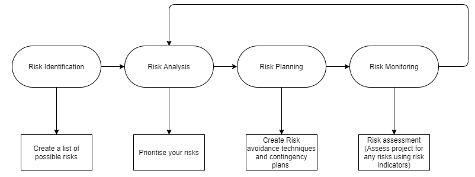
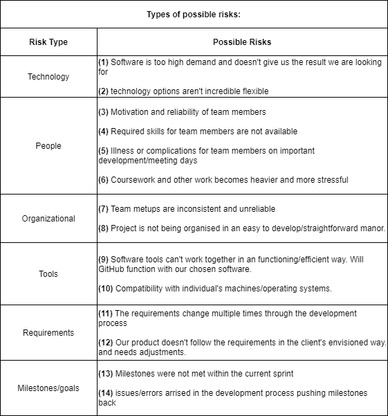
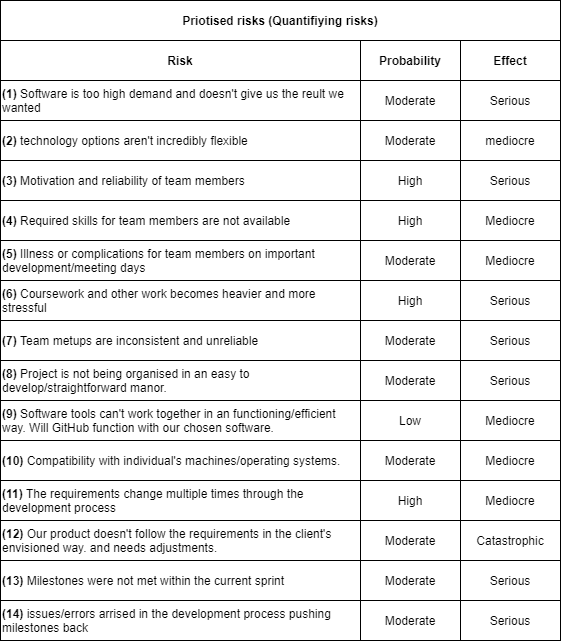
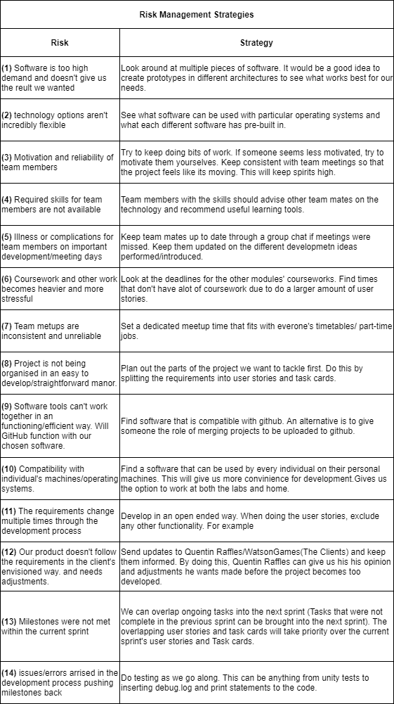
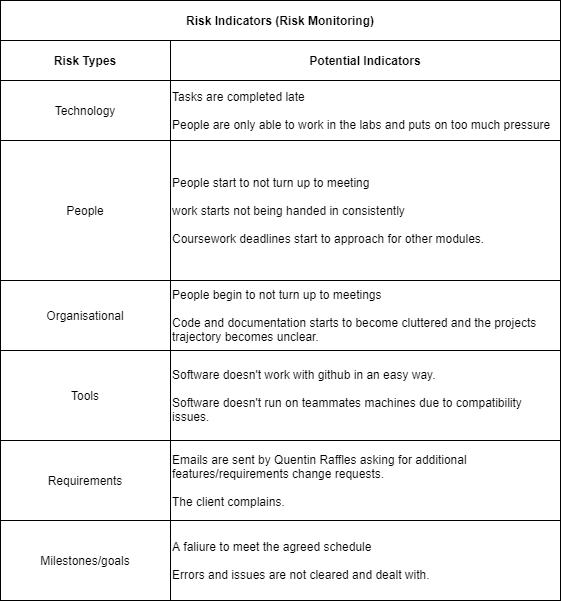

# Risk Management

During our programming project, we will need some form of risk management. In software development it is enevitable that probles will arise. This will minimise these problems and create plans to deal with and eradicate them if they do arise

## Risk Identification:

## Risk Analysis:

## Risk Planning:

## Risk Monitoring:

